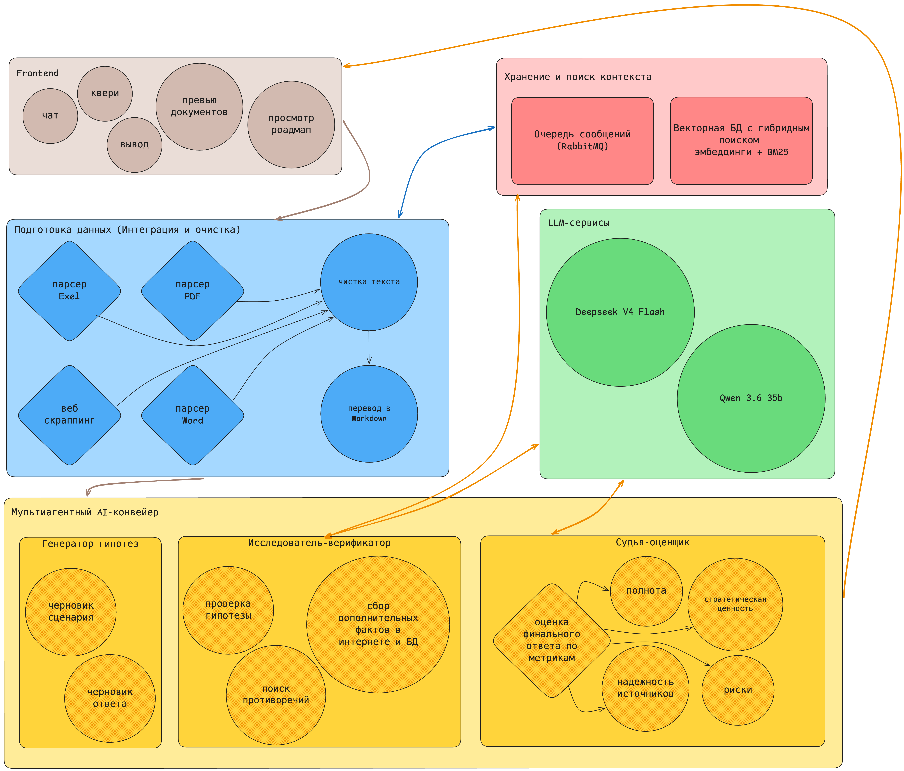

# Фабрика гипотез — описание решения

## 1. Аннотация

**Фабрика гипотез** — интеллектуальная система для генерации, приоритизации и планирования проверки научно-исследовательских гипотез в области материаловедения и металлургии. Система принимает на вход описание технологической проблемы, ограничения и набор документов (статьи, патенты, отчёты, URL), а на выходе формирует структурированный список проверяемых гипотез с научным обоснованием, ссылками на источники, оценкой рисков и дорожной картой верификации.

Решение построено на архитектуре RAG (Retrieval-Augmented Generation) с тремя LLM-агентами — Генератор, Критик и Валидатор — работающими в цикле взаимной проверки для обеспечения качества и обоснованности гипотез. Пользовательский интерфейс выполнен в виде одностраничного веб-приложения с чат-интерфейсом, загрузкой документов и визуализацией дорожных карт.

Система разворачивается через Docker Compose, поддерживает работу с конфиденциальными данными в локальном контуре и масштабируется на новые предметные области без перестройки ядра.

---

## 2. Проблематика

На старте научно-исследовательских проектов в НИИ и промышленных лабораториях отсутствует системный механизм генерации и приоритизации гипотез. Это приводит к пяти ключевым проблемам:

1. **Субъективность и зависимость от экспертов** — идеи формируются вручную, опираясь на опыт отдельных сотрудников, что снижает воспроизводимость и создаёт «узкие места».

2. **Низкая связность с бизнес-частью** — предлагаемые гипотезы не всегда связаны с проработкой бизнес-эффекта, что ведёт к дублированию известных решений или игнорированию перспективных направлений.

3. **Неэффективное использование исторических данных** — накопленные отчёты и результаты экспериментов остаются в виде неструктурированных архивов, не используемых для генерации новых идей.

4. **Отсутствие прозрачной оценки** — нет единого формата обоснования гипотез: сложно сравнить варианты по новизне, рискам, требуемым ресурсам и ожидаемой ценности.

5. **Замедление старта проектов** — время на формулировку и согласование исследовательских направлений растягивается на недели, что снижает общую скорость инновационного цикла.

---

## 3. Архитектура решения

<!--  -->
<div align="center">

</div>

### 3.1. Микросервисы

Система состоит из шести микросервисов, оркестрируемых через Docker Compose:

| Сервис | Порт | Назначение | Технологии |
|---|---|---|---|
| **Frontend** | 80 | SPA: чат, загрузка документов, превью, визуализация дорожных карт | React 19, TypeScript 6, Tailwind CSS v4, Vite, nginx |
| **LLM Service** | 8000 | API-шлюз к языковым моделям: чат, генерация, SSE-стриминг | FastAPI (Python 3.11), YandexGPT, Alice LLM, Qwen 3.6 35B |
| **Data Processor** | 8001 | Конвертация файлов (PDF/DOCX/XLSX/изображения) в Markdown | FastAPI (Python 3.12), opendataloader, docx2md, openpyxl |
| **Manual Analysis** | 8002 | Детерминированный анализ Excel с данными флотации: выявление статей потерь металлов | FastAPI (Python 3.12), pandas, openpyxl |
| **Content Extraction** | 8005 | Извлечение контента из веб-страниц: рендеринг Chromium → Readability → Markdown | FastAPI (Python 3.12), Playwright, readability-lxml, markdownify |
| **GraphRAG** | RabbitMQ | Гибридный поиск (BM25 + embeddings), граф знаний, text-to-Cypher | Neo4j, Qdrant, RabbitMQ, DeepSeek API |

### 3.2. Поток данных

```
Пользователь → Frontend (nginx:80)
                    ├─ /api/v1/chat*        → LLM Service (8000)
                    ├─ /api/v1/convert*      → Data Processor (8001) — PDF/DOCX/XLSX → Markdown
                    ├─ /api/v1/analyze       → Manual Analysis (8002) — Excel хвостов → CSV
                    ├─ /api/v1/extract       → Content Extraction (8005) — URL → Markdown
                    └─ (через LLM Service)   → GraphRAG (RabbitMQ) — гибридный поиск + граф
```

### 3.3. Три агента — цикл генерации и проверки

1. **Agent 1 — Generator (DeepSeek V4)**
   - Принимает запрос пользователя + релевантные чанки из векторной БД
   - Генерирует Top-N гипотез: формулировка, механизм, источники
   - Может вызывать VLM (Qwen 3.6 35B) для анализа схем и изображений

2. **Agent 2 — Actor / Validator (DeepSeek V4)**
   - Проверяет гипотезу: поиск подтверждающих источников (БД, Google Scholar, Arxiv)
   - Верифицирует ссылки, формирует обоснование
   - Если не может устранить замечания Judge — отбрасывает гипотезу

3. **Agent 3 — Judge / Critic (DeepSeek V4)**
   - Критикует гипотезу: целенаправленно ищет контраргументы
   - Оценивает по пяти бинарным метрикам:
     - Полнота обоснования (вес 0.5)
     - Наличие ссылок на источники (блокирующая)
     - Механизм влияния + новизна (вес 0.3)
     - Анализ рисков (блокирующая)
     - Ожидаемая ценность / KPI (вес 0.2)
   - Возвращает гипотезу Actor'у на доработку до достижения пороговых значений

### 3.4. RAG и поиск

- **Гибридный поиск:** BM25 (разреженный) + dense embeddings (плотный) → Reciprocal Rank Fusion
- **GraphRAG:** граф знаний (Neo4j), обход на 2-3 hop по Swanson ABC (форма → механизм → интервенция)
- **Метаданные чанка:** summary, вопросы для поиска, заголовок, подзаголовок, источник, привязка к ячейке Excel
- **Provenance:** citation с page/paragraph/excel_cell и highlight overlap

---

## 4. Функциональные возможности

### 4.1. Интерфейс пользователя

- **Чат с LLM:** текстовые запросы, поддержка изображений (VLM), потоковый вывод (SSE)
- **Загрузка документов:**
  - Drag-and-drop файлов (PDF, DOCX, XLSX, PNG, JPG) с конвертацией в Markdown
  - Загрузка по URL с автоматической экстракцией контента (Chromium + Readability)
  - Визуальный прогресс-бар с процентами
- **Превью документов:**
  - Вкладка «Инфо»: метаданные, размер, тип, дата, источник, HTTP-статус
  - Вкладка «Контент»: рендеринг Markdown с кодом, таблицами, ссылками
  - Вкладка «Файл»: просмотр PDF и изображений через iframe (blob URL)
- **Дорожная карта:** вертикальный таймлайн с этапами, ресурсами, сроками и критериями успеха/провала
- **HypothesisCard:** карточка гипотезы с новизной, рисками, confidence bar, источниками
- **GenerationOverlay:** анимация генерации с нодами агентов (Generator/Actor/Judge)
- **Экспертная настройка:** количество гипотез (3-10), глубина цикла (1-5), температура (0-1)
- **Тёмная тема:** переключатель с сохранением в localStorage
- **Ресайзабельные панели:** сайдбар (до 35% экрана) и превью (до 45% экрана)
- **Persistence:** документы и извлечённый контент в localStorage

### 4.2. API

| Метод | Путь | Назначение | Сервис |
|---|---|---|---|
| `POST` | `/api/v1/chat` | Чат с LLM (текст + изображения) | llm-service |
| `POST` | `/api/v1/chat/stream` | Потоковый чат (SSE) | llm-service |
| `GET`  | `/api/v1/health` | Health check | llm-service |
| `GET`  | `/api/v1/models` | Список доступных моделей | llm-service |
| `POST` | `/api/v1/convert` | Конвертация файла в Markdown | data-processor |
| `POST` | `/api/v1/convert/batch` | Пакетная конвертация (до 50 файлов) | data-processor |
| `GET`  | `/api/v1/convert/{file}/raw` | Получить сконвертированный Markdown | data-processor |
| `POST` | `/api/v1/analyze` | Анализ Excel хвостов → статьи потерь | manual-analysis |
| `POST` | `/api/v1/extract` | Экстракция контента из URL | content-extraction |
| `POST` | `/api/v1/hypotheses/generate` | Генерация гипотез | llm-service (контракт) |
| `POST` | `/api/v1/hypotheses/{id}/roadmap` | Дорожная карта проверки | llm-service (контракт) |
| `POST` | `/api/v1/hypotheses/{id}/feedback` | Обратная связь эксперта | llm-service (контракт) |

Полная спецификация: `api-spec.json`

### 4.3. GraphRAG (RabbitMQ)

Граф знаний и гибридный поиск работают через RabbitMQ (не REST):

- **Exchange:** `hypothesis.factory` (topic)
- **Очереди:** `chunks_text`, `graph_triplets`, `graph_rag_query`, `nl_cypher_query`, `ingest_bootstrap`
- **RPC Client:** `GraphRagMessagingClient` — методы `graphrag_query()`, `ingest_markdown()`, `nl_cypher_ask()`
- **Инфраструктура:** Neo4j (7474/7687), Qdrant (6333/6334), RabbitMQ (5672/15672)
- **Text-to-Cypher:** запросы на естественном языке → безопасный read-only Cypher

---

## 5. Технический стек

| Слой | Технологии |
|---|---|
| Frontend | React 19, TypeScript 6.0, Tailwind CSS v4, Vite 8, Lucide Icons, react-markdown + remark-gfm |
| LLM Gateway | FastAPI (Python 3.11), OpenAI SDK (Yandex-совместимый), uvicorn, asyncio |
| Data Processor | FastAPI (Python 3.12), opendataloader, docx2md, openpyxl, pandas |
| Content Extraction | FastAPI (Python 3.12), Playwright + Chromium, readability-lxml, BeautifulSoup4, markdownify |
| Manual Analysis | FastAPI (Python 3.12), pandas, openpyxl |
| GraphRAG | Neo4j (Cypher), Qdrant (векторный поиск), RabbitMQ (RPC), DeepSeek API |
| Модели | YandexGPT (текст), Alice LLM (чат), Qwen 3.6 35B (VLM), DeepSeek V4 (агенты) |
| Инфраструктура | Docker Compose, nginx (SPA + reverse proxy), SSE streaming |

---

## 6. Развёртывание

```bash
git clone <repo>
cd nornikel-hypothesis-fabric

# LLM-сервис
cp llm-service/.env.example llm-service/.env
# YANDEX_API_KEY=... YANDEX_FOLDER_ID=...

# Data Processor
cp data-processor/.env.example data-processor/.env

# Manual Analysis
cp manual-analysis/.env.example manual-analysis/.env

# GraphRAG
cp graphrag-service/.env.example graphrag-service/.env

# Запуск всех сервисов
docker compose up --build
```

После запуска:

| Сервис | URL |
|---|---|
| Frontend | http://localhost |
| LLM Service | http://localhost:8000/docs |
| Data Processor | http://localhost:8001/docs |
| Manual Analysis | http://localhost:8002/docs |
| Content Extraction | http://localhost:8005/docs |
| Neo4j Browser | http://localhost:7474 (neo4j / hypothesis2026) |
| RabbitMQ UI | http://localhost:15672 (hypothesis / hypothesis2026) |

---

## 7. Соответствие требованиям

| Требование | Реализация |
|---|---|
| **Полезность для исследователей** | Гипотезы конкретны, проверяемы, с лабораторными критериями успеха/провала |
| **Прозрачность и обоснованность** | Каждая гипотеза — rationale + источники + механизм; UI показывает всю цепочку |
| **Гибкость входных данных** | Текст, файлы (PDF/DOCX/XLSX/PNG), URL — конвертируются в Markdown |
| **Масштабируемость** | Предметная область задаётся конфигурацией графа знаний, ядро не меняется |
| **Интеграция** | Docker Compose, API-first, контракт для Jira/YouTrack |
| **Интерпретируемость** | Три агента с бинарными метриками, provenance для каждого чанка |
| **Мультиязычность** | YandexGPT + Qwen + DeepSeek поддерживают ru/en/zh |
| **Надёжность** | Обработка ошибок экстракции/конвертации, fallback-модели |
| **Производительность** | SSE-стриминг, параллельная конвертация файлов |
| **Безопасность** | Локальное развёртывание (Docker), конфиденциальные данные не покидают контур |
