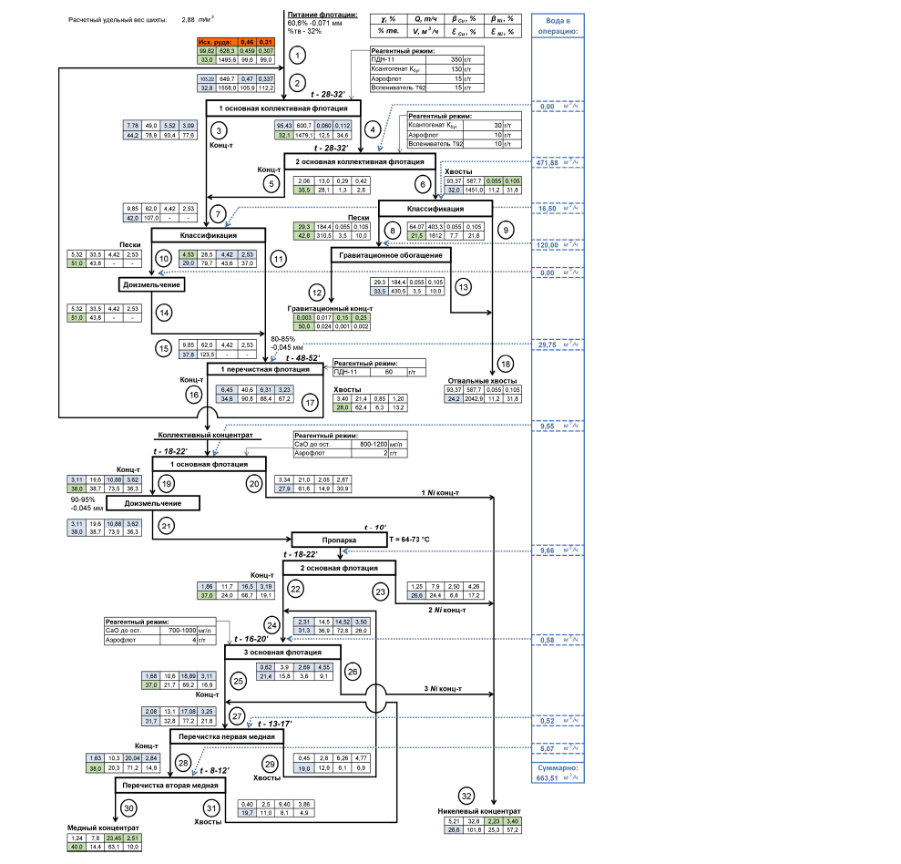

graph TD
    %% Стилизация элементов
    classDef process fill:#f9f,stroke:#333,stroke-width:2px;
    classDef product fill:#ccf,stroke:#333,stroke-width:1px;
    classDef final fill:#8f8,stroke:#333,stroke-width:2px;
    classDef water fill:#e1f5fe,stroke:#0288d1,stroke-width:1px,stroke-dasharray: 5 5;

    %% Исходное сырье
    Ore([Исходная руда]) --> F1[1 основная коллективная флотация]

    %% ПОДГРАФ 1: Коллективная флотация (Этапы 1 и 2)
    subgraph Коллективная_флотация [Коллективная флотация]
        F1 -->|Концентрат 3| F3[1 перечистная флотация]
        F1 -->|Хвосты 4| F2[2 основная коллективная флотация]
        
        F2 -->|Концентрат 5| F3
        F2 -->|Хвосты 6| Cl1[Классификация 8-9]
    end

    %% ПОДГРАФ 2: Гравитационное обогащение и измельчение
    subgraph Гравитация_и_Измельчение [Гравитационное обогащение и Классификация]
        Cl1 -->|Пески| Gr1[Гравитационное обогащение 12-13]
        Cl1 -->|Слив| Tail_Dump([Отвальные хвосты 18])
        
        Gr1 -->|Гравитационный концентрат| F3
        Gr1 -->|Промпродукт| Cl2[Классификация 10-11]
        
        Cl2 -->|Пески| Grind1[Доизмельчение 14-15]
        Cl2 -->|Слив| F3
        
        Grind1 --> Cl2
    end

    %% ПОДГРАФ 3: Перечистная флотация и подготовка концентрата
    subgraph Перечистка_коллективного_концентрата [Перечистная коллективная флотация]
        F3 -->|Концентрат 16| Coll_Conc[Коллективный концентрат]
        F3 -->|Хвосты 17| Tail_Dump
        
        Coll_Conc --> F_Cu_Ni_1[1 основная флотация Cu-Ni]
    end

    %% ПОДГРАФ 4: Селективная флотация (Разделение меди и никеля)
    subgraph Селекция_Медь_Никель [Селективная флотация Cu-Ni]
        F_Cu_Ni_1 -->|Концентрат 19| Grind2[Доизмельчение]
        F_Cu_Ni_1 -->|Хвосты 20| Ni_Conc_1([1 Ni концентрат])
        
        Grind2 --> Steam[Пропарка T=64-73 °C]
        
        Steam --> F_Cu_Ni_2[2 основная флотация Cu-Ni]
        
        F_Cu_Ni_2 -->|Концентрат 22| F_Cu_Ni_3[3 основная флотация Cu-Ni]
        F_Cu_Ni_2 -->|Хвосты 23| Ni_Conc_2([2 Ni концентрат])
        
        F_Cu_Ni_3 -->|Концентрат 25| Cl_Cu_1[Перечистка первая медная 28-29]
        F_Cu_Ni_3 -->|Хвосты 26| Ni_Conc_3([3 Ni концентрат])
    end

    %% ПОДГРАФ 5: Получение конечных концентратов меди и никеля
    subgraph Конечные_продукты [Выделение Медного концентрата]
        Cl_Cu_1 -->|Концентрат 28| Cl_Cu_2[Перечистка вторая медная 30-31]
        Cl_Cu_1 -->|Хвосты 29| F_Cu_Ni_3
        
        Cl_Cu_2 -->|Концентрат 30| Med_Conc([Медный концентрат])
        Cl_Cu_2 -->|Хвосты 31| F_Cu_Ni_2
    end

    %% Объединение никелевых потоков
    Ni_Conc_1 --> Ni_Final([Никелевый концентрат 32])
    Ni_Conc_2 --> Ni_Final
    Ni_Conc_3 --> Ni_Final

    %% Применение стилей к ключевым узлам
    class Ore product;
    class Med_Conc,Ni_Final,Tail_Dump final;
    class F1,F2,F3,F_Cu_Ni_1,F_Cu_Ni_2,F_Cu_Ni_3,Cl_Cu_1,Cl_Cu_2 process;
    class Cl1,Cl2,Gr1,Grind1,Grind2,Steam process;
