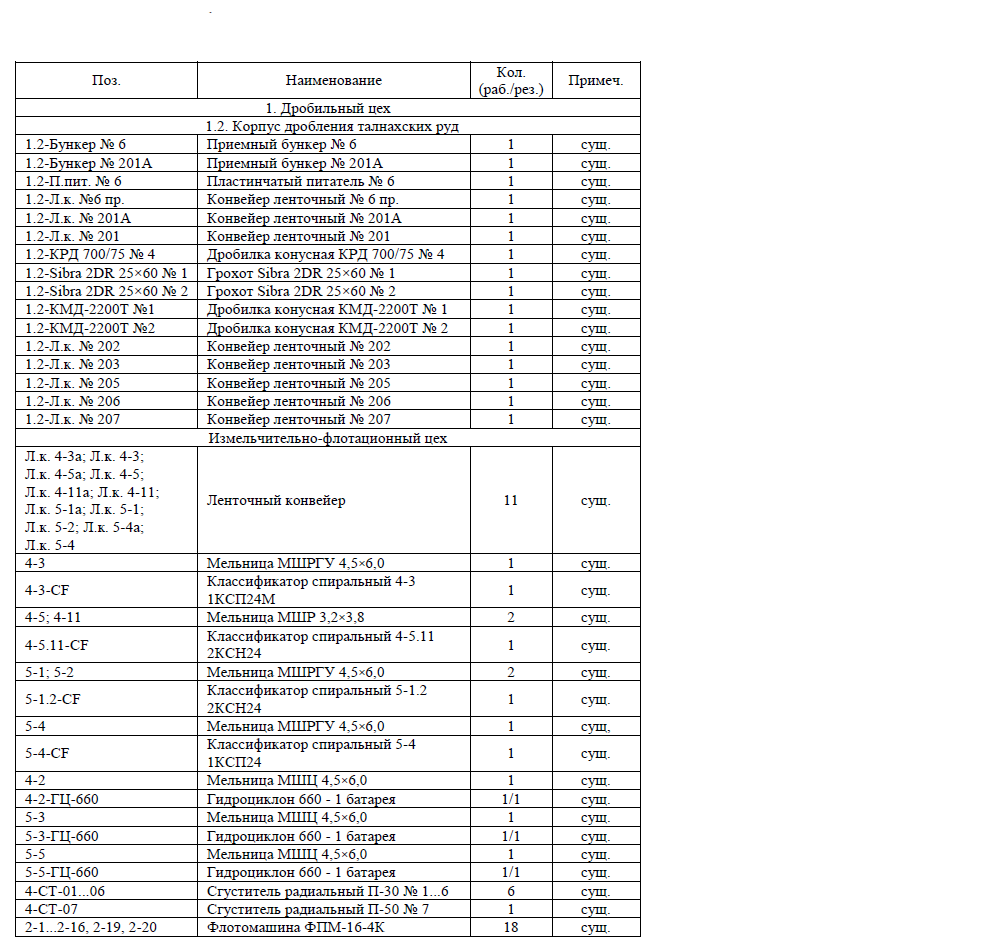

| Поз. | Наименование | Кол. (раб./рез.) | Примеч. |
|:---|:---|:---|:---|
| | 1. Дробильный цех | | |
| | 1.2. Корпус дробления талнахских руд | | |
| 1.2-Бункер № 6 | Приемный бункер № 6 | 1 | суш. |
| 1.2-Бункер № 201А | Приемный бункер № 201А | 1 | суш. |
| 1.2-П.пит. № 6 | Пластинчатый питатель № 6 | 1 | суш. |
| 1.2-Л.к. №6 пр. | Конвейер ленточный № 6 пр. | 1 | суш. |
| 1.2-Л.к. № 201А | Конвейер ленточный № 201А | 1 | суш. |
| 1.2-Л.к. № 201 | Конвейер ленточный № 201 | 1 | суш. |
| 1.2-КРД 700/75 № 4 | Дробилка конусная КРД 700/75 № 4 | 1 | суш. |
| 1.2-Sibra 2DR 25×60 № 1 | Грохот Sibra 2DR 25×60 № 1 | 1 | суш. |
| 1.2-Sibra 2DR 25×60 № 2 | Грохот Sibra 2DR 25×60 № 2 | 1 | суш. |
| 1.2-КМД-2200Т №1 | Дробилка конусная КМД-2200Т № 1 | 1 | суш. |
| 1.2-КМД-2200Т №2 | Дробилка конусная КМД-2200Т № 2 | 1 | суш. |
| 1.2-Л.к. № 202 | Конвейер ленточный № 202 | 1 | суш. |
| 1.2-Л.к. № 203 | Конвейер ленточный № 203 | 1 | суш. |
| 1.2-Л.к. № 205 | Конвейер ленточный № 205 | 1 | суш. |
| 1.2-Л.к. № 206 | Конвейер ленточный № 206 | 1 | суш. |
| 1.2-Л.к. № 207 | Конвейер ленточный № 207 | 1 | суш. |
| | Измельчительно-флотационный цех | | |
| Л.к. 4-3а; Л.к. 4-3; Л.к. 4-5а; Л.к. 4-5; Л.к. 4-11а; Л.к. 4-11; Л.к. 5-1а; Л.к. 5-1; Л.к. 5-2; Л.к. 5-4а; Л.к. 5-4 | Ленточный конвейер | 11 | суш. |
| 4-3 | Мельница МШРГУ 4,5×6,0 | 1 | суш. |
| 4-3-CF | Классификатор спиральный 4-3 1КСП24М | 1 | суш. |
| 4-5; 4-11 | Мельница МШР 3,2×3,8 | 2 | суш. |
| 4-5.11-CF | Классификатор спиральный 4-5.11 2КСН24 | 1 | суш. |
| 5-1; 5-2 | Мельница МШРГУ 4,5×6,0 | 2 | суш. |
| 5-1.2-CF | Классификатор спиральный 5-1.2 2КСН24 | 1 | суш. |
| 5-4 | Мельница МШРГУ 4,5×6,0 | 1 | суш. |
| 5-4-CF | Классификатор спиральный 5-4 1КСП24 | 1 | суш. |
| 4-2 | Мельница МШЦ 4,5×6,0 | 1 | суш. |
| 4-2-ГЦ-660 | Гидроциклон 660 - 1 батарея | 1/1 | суш. |
| 5-3 | Мельница МШЦ 4,5×6,0 | 1 | суш. |
| 5-3-ГЦ-660 | Гидроциклон 660 - 1 батарея | 1/1 | суш. |
| 5-5 | Мельница МШЦ 4,5×6,0 | 1 | суш. |
| 5-5-ГЦ-660 | Гидроциклон 660 - 1 батарея | 1/1 | суш. |
| 4-СТ-01...06 | Сгуститель радиальный П-30 № 1...6 | 6 | суш. |
| 4-СТ-07 | Сгуститель радиальный П-50 № 7 | 1 | суш. |
| 2-1...2-16, 2-19, 2-20 | Флотомашина ФПМ-16-4К | 18 | суш. |
