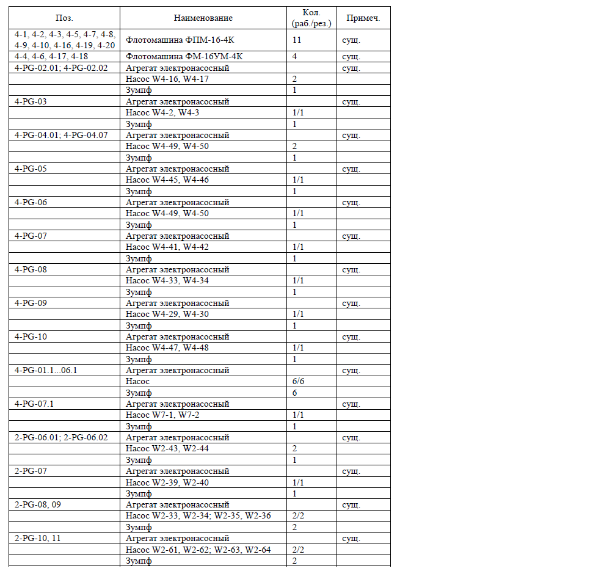

| Поз. | Наименование | Кол. (раб./рез.) | Примеч. |
|:--------|:--------|:--------|:--------|
| 4-1, 4-2, 4-3, 4-5, 4-7, 4-8, 4-9, 4-10, 4-16, 4-19, 4-20 | Флотомашина ФПМ-16-4К | 11 | сущ. |
| 4-4, 4-6, 4-17, 4-18 | Флотомашина ФМ-16УМ-4К | 4 | сущ. |
| 4-PG-02.01; 4-PG-02.02 | Агрегат электронасосный | | сущ. |
| | Насос W4-16, W4-17 | 2 | |
| | Зумпф | 1 | |
| 4-PG-03 | Агрегат электронасосный | | сущ. |
| | Насос W4-2, W4-3 | 1/1 | |
| | Зумпф | 1 | |
| 4-PG-04.01; 4-PG-04.07 | Агрегат электронасосный | | сущ. |
| | Насос W4-49, W4-50 | 2 | |
| | Зумпф | 1 | |
| 4-PG-05 | Агрегат электронасосный | | сущ. |
| | Насос W4-45, W4-46 | 1/1 | |
| | Зумпф | 1 | |
| 4-PG-06 | Агрегат электронасосный | | сущ. |
| | Насос W4-49, W4-50 | 1/1 | |
| | Зумпф | 1 | |
| 4-PG-07 | Агрегат электронасосный | | сущ. |
| | Насос W4-41, W4-42 | 1/1 | |
| | Зумпф | 1 | |
| 4-PG-08 | Агрегат электронасосный | | сущ. |
| | Насос W4-33, W4-34 | 1/1 | |
| | Зумпф | 1 | |
| 4-PG-09 | Агрегат электронасосный | | сущ. |
| | Насос W4-29, W4-30 | 1/1 | |
| | Зумпф | 1 | |
| 4-PG-10 | Агрегат электронасосный | | сущ. |
| | Насос W4-47, W4-48 | 1/1 | |
| | Зумпф | 1 | |
| 4-PG-01.1...06.1 | Агрегат электронасосный | | сущ. |
| | Насос | 6/6 | |
| | Зумпф | 6 | |
| 4-PG-07.1 | Агрегат электронасосный | | сущ. |
| | Насос W7-1, W7-2 | 1/1 | |
| | Зумпф | 1 | |
| 2-PG-06.01; 2-PG-06.02 | Агрегат электронасосный | | сущ. |
| | Насос W2-43, W2-44 | 2 | |
| | Зумпф | 1 | |
| 2-PG-07 | Агрегат электронасосный | | |
| | Насос W2-39, W2-40 | 1/1 | |
| | Зумпф | 1 | |
| 2-PG-08, 09 | Агрегат электронасосный | | сущ. |
| | Насос W2-33, W2-34; W2-35, W2-36 | 2/2 | |
| | Зумпф | 2 | |
| 2-PG-10, 11 | Агрегат электронасосный | | сущ. |
| | Насос W2-61, W2-62; W2-63, W2-64 | 2/2 | |
| | Зумпф | 2 | |
