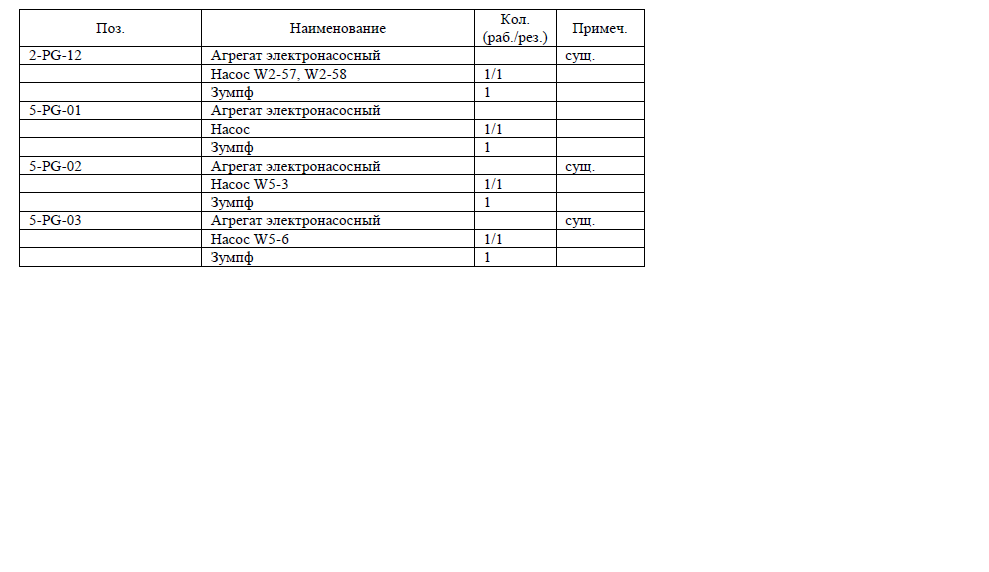

| Поз. | Наименование | Кол. (раб./рез.) | Примеч. |
|:--------|:--------|:--------|:--------|
| 2-PG-12 | Агрегат электронасосный | | сущ. |
| | Насос W2-57, W2-58 | 1/1 | |
| | Зумпф | 1 | |
| 5-PG-01 | Агрегат электронасосный | | |
| | Насос | 1/1 | |
| | Зумпф | 1 | |
| 5-PG-02 | Агрегат электронасосный | | сущ. |
| | Насос W5-3 | 1/1 | |
| | Зумпф | 1 | |
| 5-PG-03 | Агрегат электронасосный | | сущ. |
| | Насос W5-6 | 1/1 | |
| | Зумпф | 1 | |
