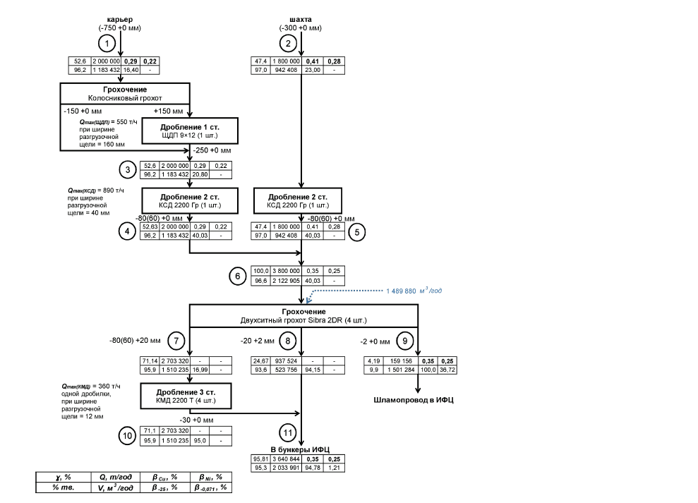

flowchart TD
    1["карьер (-750 +0 мм) 52.6 2 000 000 0,29 0,22 96.2 1 183 432 18,40 -"]
    2["шахта (-300 +0 мм) 47.4 1 800 000 0,41 0,28 97.0 942 408 23,00 -"]
    3["Грохочение Колосниковый грохот -150 +0 мм +150 мм Qmax(щеп) = 550 т/ч при ширине разгрузочной щели = 160 мм Дробление 1 ст. ЩДП 9×12 (1 шт.) -250 +0 мм 52.6 2 000 000 0,29 0,22 96.2 1 183 432 20,80 -"]
    4["Qmax(КЩД) = 890 т/ч при ширине разгрузочной щели = 40 мм Дробление 2 ст. КЩД 2200 Гр (1 шт.) -80(60) +0 мм 52.63 2 000 000 0,29 0,22 96.2 1 183 432 40,03 -"]
    5["Дробление 2 ст. КЩД 2200 Гр (1 шт.) -80(60) +0 мм 47.4 1 800 000 0,41 0,28 97.0 942 408 40,03 -"]
    6["100,0 3 800 000 0,35 0,25 96,6 2 122 905 40,03 - 1 489 880 м³/год"]
    7["Грохочение Двухситный грохот Sibra 2DR (4 шт.) -80(60) +20 мм 71,14 2 703 320 - - 95,9 1 510 235 16,99 -"]
    8["-20 +2 мм 24,67 937 524 - - 93,6 523 756 94,15 -"]
    9["-2 +0 мм 4,19 159 156 0,35 0,25 9,9 1 501 284 100,0 36,72 Шламопровод в ИФЦ"]
    10["Qmax(КЩД) = 360 т/ч одной дробилки, при ширине разгрузочной щели = 12 мм Дробление 3 ст. КЩД 2200 Т (4 шт.) -30 +0 мм 71,1 2 703 320 - - 95,9 1 510 235 95,0 -"]
    11["В бункеры ИФЦ 95,81 3 640 844 0,35 0,25 95,3 2 033 981 94,78 1,21"]
    Legend["x, % Q, m³/год βсш, % βмл, % % тв. V, м³/год βзб, % βо.отл, %"]

    1 --> 3
    2 --> 5
    3 --> 4
    4 --> 6
    5 --> 6
    6 --> 7
    6 --> 8
    6 --> 9
    7 --> 10
    10 --> 11
    8 --> 11
