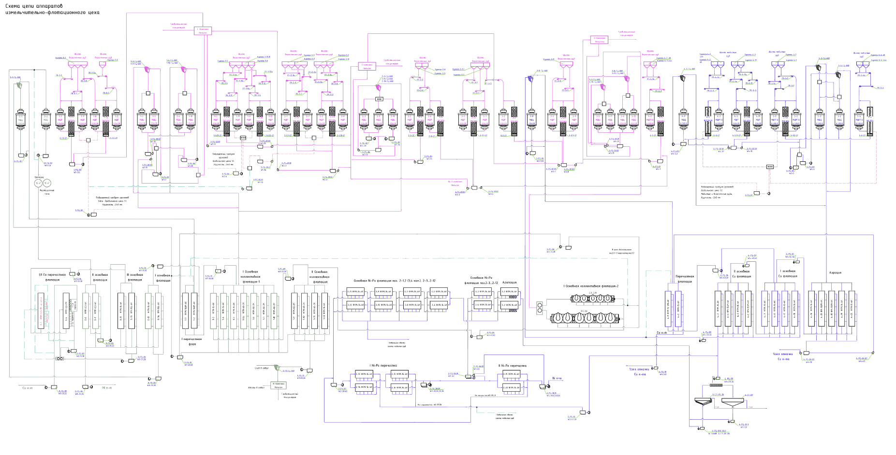

flowchart TD
    A[Схема цепи аппаратов измельчительно-флотационного цеха]
    B[Гидроциклонный узел]
    C[Сгуститель]
    D[Сгуститель]
    E[I ст. перекачка флотация]
    F[II ст. перекачка флотация]
    G[III ст. перекачка флотация]
    H[I Секция колонковая флотация]
    I[II Секция колонковая флотация]
    J[Особая Ni-Fe флотация]
    K[Особая Ni-Fe флотация 2-3, 2-12]
    L[Агитация]
    M[I Секция колонковая флотация-2]
    N[Перечистная флотация]
    O[II особая Cu флотация]
    P[I особая Cu флотация]
    Q[Агитация]
    R[Концентрат]

    A --> B
    A --> C
    A --> D
    B --> E
    C --> F
    D --> G
    E --> H
    F --> I
    G --> J
    H --> K
    I --> L
    J --> M
    K --> N
    L --> O
    M --> P
    N --> Q
    O --> R
    P --> R
    Q --> R
