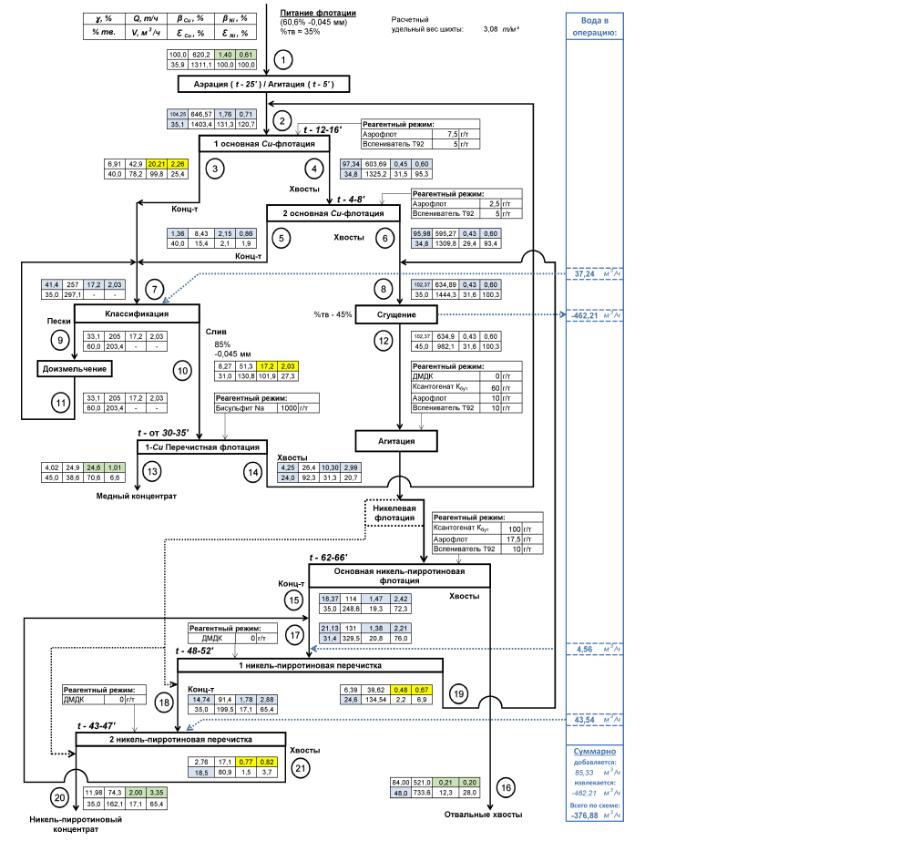

flowchart TD
    A["Питание флотации
(60,6% -0,045 мм)
%тв = 35%
Расчетный удельный вес шликера: 3,08 т/м³"]
    B["Аэрация (t - 25') / Агитация (t - 6')"]
    C["1 основная Cu-флотация"]
    D["2 основная Cu-флотация"]
    E["Классификация"]
    F["Пески"]
    G["Дозизмельчение"]
    H["1-Cu Перечистная флотация"]
    I["Никелевая флотация"]
    J["Основная никель-пиритиновая флотация"]
    K["1 никель-пиритиновая перечистка"]
    L["2 никель-пиритиновая перечистка"]
    M["Никель-пиритиновый концентрат"]
    N["Отвальные хвосты"]
    O["Сгущение"]

    A --> B
    B --> C
    C --> D
    D --> E
    D --> O
    E --> F
    F --> G
    G --> H
    O --> H
    H --> I
    I --> J
    J --> K
    K --> L
    L --> M
    J --> N
    K --> N
    L --> N
