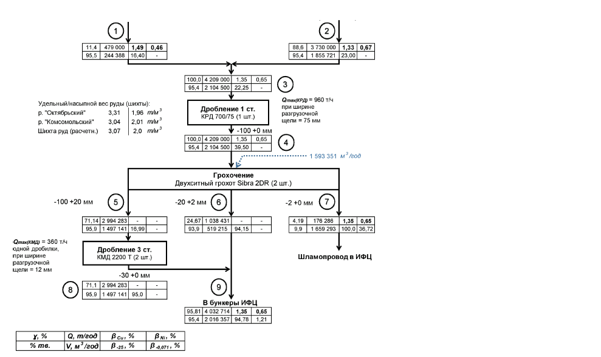

flowchart TD
    subgraph Input_Stage
        N1[1 11.4 479 000 1,49 0,46 95,5 244 388 16,40 -]
        N2[2 88,6 3 730 000 1,33 0,67 95,4 1 855 721 23,00 -]
    end

    N1 --> Combined
    N2 --> Combined

    Combined[100,0 4 209 000 1,35 0,65 95,4 2 104 500 22,25 -]

    Combined --> D1[3 Дробление 1 ст. КРД 700/75 (1 шт.)]

    D1 --> Out1[4 100,0 4 209 000 1,35 0,65 95,4 2 104 500 39,50 -]

    Out1 --> S1[Грохочение Двухситный грохот Sibra 2DR (2 шт.)]

    S1 --> Out5[5 -100 +20 мм 71,14 2 994 283 - - 95,9 1 497 141 16,99 -]
    S1 --> Out6[6 -20 +2 мм 24,67 1 038 431 - - 93,9 519 215 94,15 -]
    S1 --> Out7[7 -2 +0 мм 4,19 176 286 1,35 0,65 9,9 1 659 293 100,0 36,72]

    Out5 --> D3[Дробление 3 ст. КМД 2200 Т (2 шт.)]

    D3 --> Out8[8 -30 +0 мм 71,1 2 994 283 - - 95,9 1 497 141 95,0 -]

    Out6 --> Final[9 В бункеры ИФЦ 95,81 4 032 714 1,35 0,65 95,4 2 016 357 94,78 1,21]
    Out8 --> Final

    Out7 --> Sludge[Шламопровод в ИФЦ]

    subgraph Notes
        Note1[Удельный/насыпной вес руды (шихты): р. "Октябрьский" 3,31 1,96 т/м³ р. "Комсомольский" 3,04 2,01 т/м³ Шихта руды (расчетн.) 3,07 2,0 т/м³]
        Note2[Q_тех/грод = 960 т/ч при ширине разгрузочной щели = 75 мм]
        Note3[1 593 351 м³/год]
        Note4[Q_тех/КМД = 360 т/ч одной дробилки, при ширине разгрузочной щели = 12 мм]
        Legend[γ, % Q, m³/год β_Сu, % β_Ni, % % тв. V, m³/год β_ЗВ, % β_д.отл., %]
    end

    D1 -.-> Note2
    Out1 -.-> Note3
    Out5 -.-> Note4
    Note1 -.-> D1
    Legend -.-> Final
