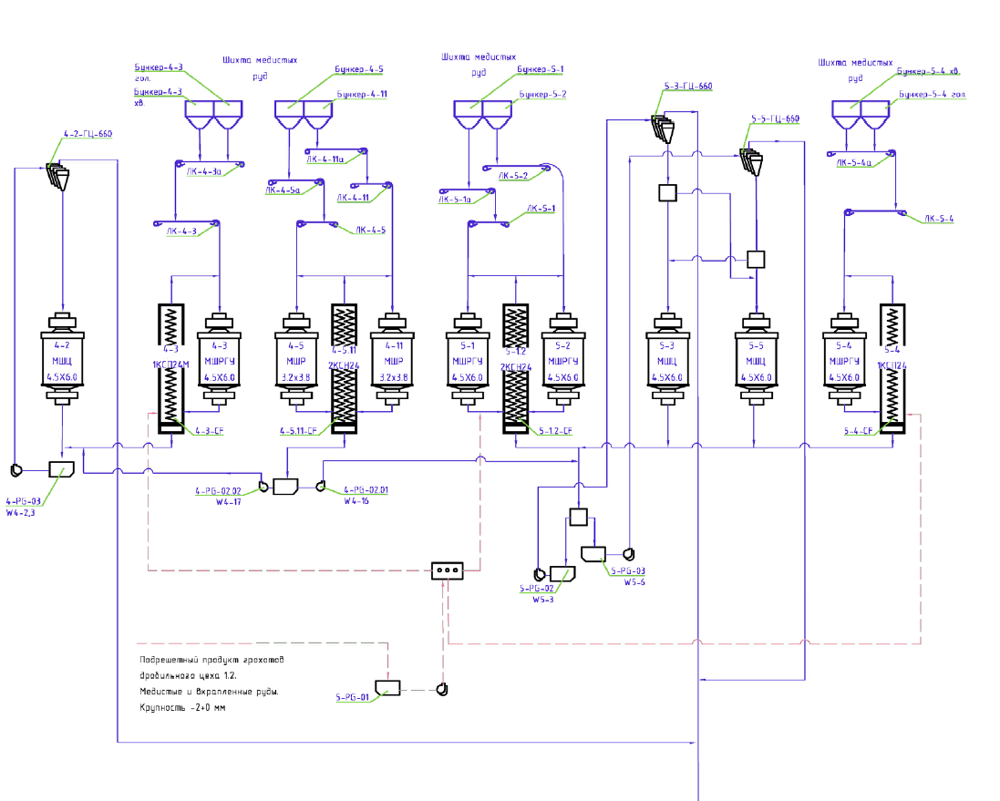

graph TD
    B43[Бункер-4-3] --> C43[4-3 МШРГУ 4.5X6.0]
    B45[Бункер-4-5] --> C45[4-5 МШР 3.2x3.5]
    B411[Бункер-4-11] --> C411[4-11 МШР 3.2x3.8]
    
    C43 --> S1[1КГ124]
    C45 --> S2[2КГН24]
    C411 --> S2
    
    S1 --> P4_17[4-РГ-02.02 W4-17]
    S2 --> P4_15[4-РГ-02.01 W4-15]
    
    C42[4-2 МЩЛ 4.5X6.0] --> P4[4-РГ-03 W4-2,3]
    
    B51[Бункер-5-1] --> C51[5-1 МШРГУ 4.5X6.0]
    B52[Бункер-5-2] --> C52[5-2 МШРГУ 4.5X6.0]
    
    C51 --> S3[2КГН24]
    C52 --> S3
    
    S3 --> P5_3[5-РГ-02 W5-3]
    
    B54[Бункер-5-4] --> C54[5-4 МШРГУ 4.5X6.0]
    C54 --> S4[1КГ124]
    S4 --> P5_5[5-РГ-03 W5-5]
    
    C53[5-3 МЩЛ 4.5X6.0] --> P5_01[5-РГ-01]
    C55[5-5 МЩЛ 4.5X6.0]
    
    Note[Подрешетный продукт грохотов дробильного цеха 12. Медистые и вкрапленные руды. Крупность -20 мм]
