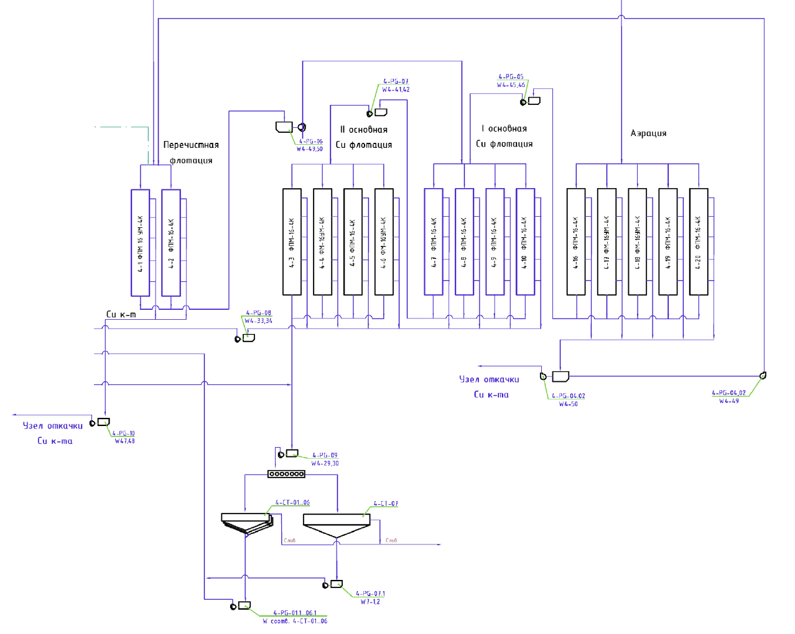

flowchart TD
    subgraph Перечистная_флотация [Перечистная флотация]
        direction TB
        A1[4-1 ФПМ-16-4К]
        A2[4-2 ФПМ-16-4К]
        I1[4-PG-10 W47,48]
    end

    subgraph II_основная_Cu_флотация [II основная Cu флотация]
        direction TB
        B1[4-3 ФПМ-16-4К]
        B2[4-4 ФПМ-16-4К]
        B3[4-5 ФПМ-16-4К]
        B4[4-6 ФПМ-16-4К]
        I2[4-PG-08 W4-33,34]
        I3[4-PG-06 W4-43,30]
        I4[4-PG-07 W4-41,42]
    end

    subgraph I_основная_Cu_флотация [I основная Cu флотация]
        direction TB
        C1[4-7 ФПМ-16-4К]
        C2[4-8 ФПМ-16-4К]
        C3[4-9 ФПМ-16-4К]
        C4[4-10 ФПМ-16-4К]
        I5[4-PG-05 W4-45,46]
    end

    subgraph Аэрация [Аэрация]
        direction TB
        D1[4-16 ФПМ-16-4К]
        D2[4-17 ФПМ-16-4К]
        D3[4-18 ФПМ-16-4К]
        D4[4-19 ФПМ-16-4К]
        D5[4-20 ФПМ-16-4К]
        I6[4-PG-04.02 W4-50]
        I7[4-PG-04.02 W4-49]
    end

    subgraph Узел_откачки [Узел откачки Cu к-та]
        E1[Узел откачки Cu к-та]
    end

    subgraph Фильтрация [Фильтрация]
        direction TB
        F1[4-СТ-01.06]
        F2[4-СТ-01]
        I8[4-PG-09 W4-29,30]
        I9[4-PG-07.1 W7-12]
        I10[4-PG-011.06.1 W coomb. 4-CT-01.06]
    end

    %% Main Flow
    E1 --> A1
    A1 --> B1
    B1 --> C1
    C1 --> D1
    D1 --> E1
    
    %% Instrument connections
    I1 -.-> A1
    I2 -.-> B1
    I3 -.-> B1
    I4 -.-> B1
    I5 -.-> C1
    I6 -.-> D1
    I7 -.-> D1
    I8 -.-> F1
    I9 -.-> F2
    I10 -.-> F1
