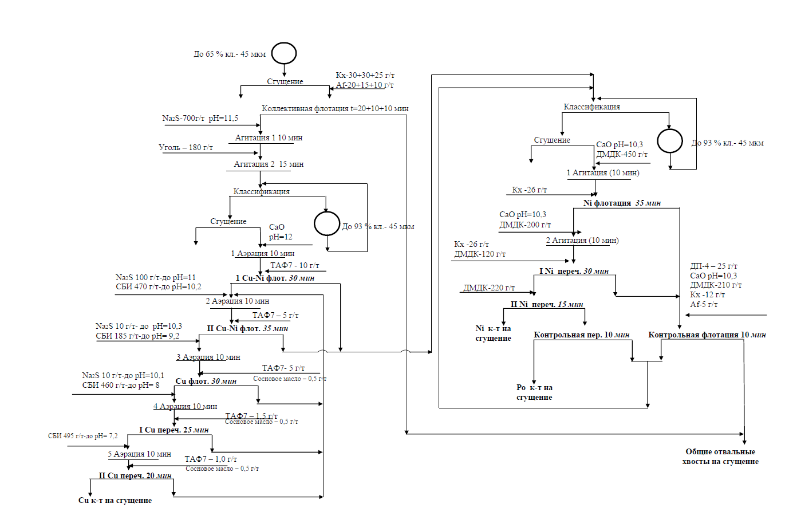

flowchart TD
    Start[До 65 % кл. - 45 мкм] --> Sclammer1[Сгущение]
    Sclammer1 -->|Кх-30+30+25 г/т Аф-20+15+10 г/т| CollFlot[Коллективная флотация t=20+10+10 мин]
    CollFlot -->|Na2S-700г/т pH=11.5 Уголь - 180 г/т| Agit1[Агитация 1 10 мин]
    Agit1 --> Agit2[Агитация 2 15 мин]
    Agit2 --> Classif1[Классификация]
    
    Classif1 -->|До 93 % кл. - 45 мкм| CollFlot
    
    Classif1 --> Sclammer2[Сгущение]
    Sclammer2 -->|СаО pH=12| Aer1[1 Аэрация 10 мин]
    Aer1 -->|Na2S 100 г/т-до pH=11 СБИ 470 г/т-до pH=10.2 ТАФ7 - 10 г/т| CuNi1[1 Cu-Ni флот. 30 мин]
    
    CuNi1 -->|Тails| TailsMain[Тails]
    CuNi1 --> Aer2[2 Аэрация 10 мин]
    Aer2 -->|ТАФ7 - 5 г/т| CuNi2[II Cu-Ni флот. 35 мин]
    CuNi2 -->|Тails| TailsMain
    CuNi2 --> Aer3[3 Аэрация 10 мин]
    Aer3 -->|Na2S 10 г/т-до pH=10.3 СБИ 185 г/т-до pH= 9.2| CuFlot[Cu флот. 30 мин]
    CuFlot -->|Тails| TailsMain
    CuFlot -->|ТАФ7- 5 г/т Сосновое масло - 0,5 г/т| Aer4[4 Аэрация 10 мин]
    Aer4 -->|Na2S 10 г/т-до pH=10.1 СБИ 460 г/т-до pH= 8| CuClean1[I Cu переч. 25 мин]
    CuClean1 -->|Тails| TailsMain
    CuClean1 -->|ТАФ7- 1,5 г/т Сосновое масло - 0,5 г/т| Aer5[5 Аэрация 10 мин]
    Aer5 -->|СБИ 495 г/т-до pH= 7.2| CuClean2[II Cu переч. 20 мин]
    CuClean2 -->|Тails| TailsMain
    CuClean2 -->|ТАФ7 - 1,0 г/т Сосновое масло - 0,5 г/т| CuConc[Cu к-т на сгущение]

    TailsMain --> Classif2[Классификация]
    
    Classif2 -->|До 93 % кл. - 45 мкм| Classif2Loop[Классификация]
    Classif2 --> Sclammer3[Сгущение]
    Sclammer3 -->|СаО pH=10.3 ДМДК-450 г/т| AgitNi1[1 Агитация (10 мин)]
    AgitNi1 -->|Кх -26 г/т| NiFlot[Ni флотация 35 мин]
    
    NiFlot -->|Тails| TailsMain2[Тails]
    NiFlot -->|ДП-4 - 25 г/т СаО pH=10.3 ДМДК-210 г/т Кх -12 г/т Аф-5 г/т| ContFlot[Контрольная флотация 10 мин]
    
    ContFlot -->|Тails| TailsMain2
    ContFlot -->|Тails| TailsMain2
    
    NiFlot --> AgitNi2[2 Агитация (10 мин)]
    AgitNi2 -->|СаО pH=10.3 ДМДК-200 г/т| NiClean1[I Ni переч. 30 мин]
    NiClean1 -->|Тails| TailsMain2
    NiClean1 -->|Кх -26 г/т ДМДК-120 г/т| NiClean2[II Ni переч. 15 мин]
    NiClean2 -->|Тails| TailsMain2
    NiClean2 -->|ДМДК-220 г/т| NiConc[Ni к-т на сгущение]
    
    NiClean1 --> ContClean[Контрольная пер. 10 мин]
    ContClean -->|Тails| TailsMain2
    ContClean --> RoConc[Ро к-т на сгущение]
    
    TailsMain2 --> GenTails[Общие отвальные хвосты на сгущение]
