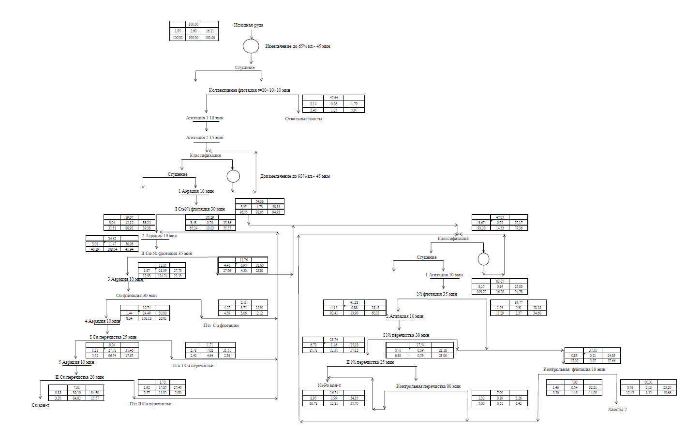

flowchart TD
    A[Исходная руда] --> B[Измельчение до 65% кл. - 45 мкм]
    B --> C[Сгущение]
    C --> D[Коллективная флотация т=30+10+10 мин]
    D --> E[Отвальные хвосты]
    D --> F[Агитация 1 10 мин]
    F --> G[Агитация 2 15 мин]
    G --> H[Классификация]
    H --> I[Сгущение]
    I --> J[1 Аэрация 10 мин]
    J --> K[I Cu-Ni флотация 30 мин]
    K --> L[2 Аэрация 10 мин]
    L --> M[II Cu-Ni флотация 55 мин]
    M --> N[3 Аэрация 10 мин]
    N --> O[Cu флотация 30 мин]
    O --> P[4 Аэрация 10 мин]
    P --> Q[I Cu перечистка 25 мин]
    Q --> R[5 Аэрация 10 мин]
    R --> S[II Cu перечистка 20 мин]
    S --> T[Cu кон-т]
    O --> U[Пп Cu флотации]
    U --> V[Пп I Cu перечистки]
    Q --> V
    S --> W[Пп II Cu перечистки]
    M --> X[Классификация]
    X --> Y[Сгущение]
    Y --> Z[1 Агитация 10 мин]
    Z --> AA[Ni флотация 25 мин]
    AA --> AB[2 Агитация 10 мин]
    AB --> AC[I Ni перечистка 30 мин]
    AC --> AD[II Ni перечистка 25 мин]
    AD --> AE[Ni-Po кон-т]
    AA --> AF[Контрольная флотация 10 мин]
    AF --> AG[Хвосты 2]
    AC --> AH[Контрольная перечистка 00 мин]
    AH --> AD
