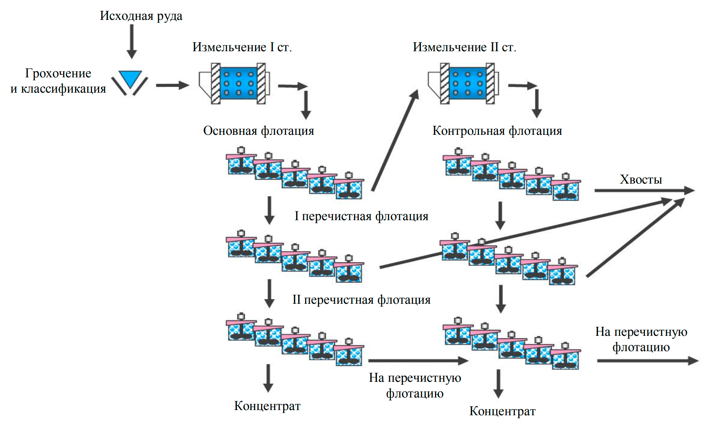

flowchart TD
    A[Исходная руда] --> B[Грохочение и классификация]
    B --> C[Измельчение I ст.]
    C --> D[Основная флотация]
    D --> E[I перечистная флотация]
    D --> H[Измельчение II ст.]
    E --> F[II перечистная флотация]
    F --> G[Концентрат]
    F --> |На перечистную флотацию| K[На перечистную флотацию]
    H --> I[Контрольная флотация]
    I --> J[Хвосты]
    I --> K
    K --> G
    K --> G
