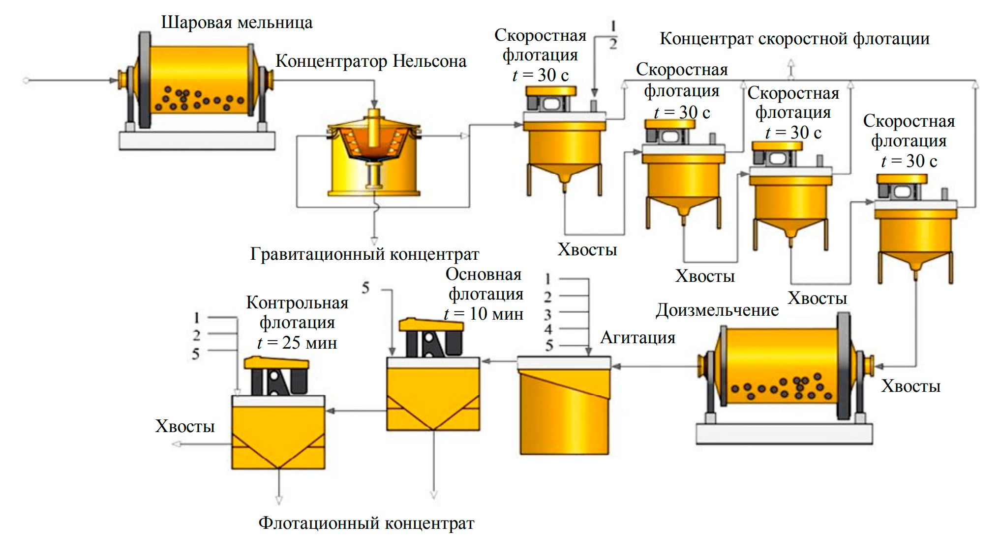

flowchart TD
    A[Шаровая мельница] --> B[Концентратор Нельсона]
    B --> C[Скоростная флотация t = 30 с]
    C --> D[Скоростная флотация t = 30 с]
    D --> E[Скоростная флотация t = 30 с]
    E --> F[Скоростная флотация t = 30 с]
    F --> G[Концентрат скоростной флотации]
    
    B --> H[Гравитационный концентрат]
    H --> I[Агитация]
    
    C --> J[Хвосты]
    D --> K[Хвосты]
    E --> L[Хвосты]
    F --> M[Хвосты]
    M --> N[Доизмельчение]
    N --> I
    
    I --> O[Основная флотация t = 10 мин]
    O --> P[Контрольная флотация t = 25 мин]
    P --> Q[Флотационный концентрат]
    P --> R[Хвосты]
