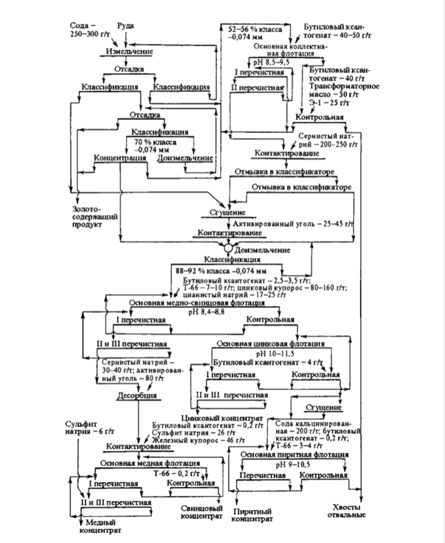

flowchart TD
    Start1["Сода - 250-300 г/т"]
    Start2["Руда"]
    Grinding["Измельчение"]
    Dewatering1["Отсадка"]
    Class1["Классификация"]
    Class2["Классификация"]
    Dewatering2["Отсадка"]
    Concentration["Концентрация"]
    Regrind1["Доизмельчение"]
    RougherFlotation["Основная коллективная флотация"]
    RougherReagents["Бутиловый ксантогенат - 40-50 г/т"]
    RougherReagents2["Бутиловый ксантогенат - 40 г/т; Трансформаторное масло - 50 г/т; 9-1-25 г/т"]
    RougherStage1["I перечистная"]
    RougherStage2["II перечистная"]
    RougherStage3["Контрольная"]
    Contact1["Контактирование"]
    Wash["Отмывка в классификаторе"]
    Thickener1["Сгущение"]
    ActivatedCarbon["Активированный уголь - 25-45 г/т"]
    Contact2["Контактирование"]
    Regrind2["Доизмельчение"]
    Class3["Классификация 88-92% кл. -0,074 мм"]
    Class3Reagents["Бутиловый ксантогенат - 2,5-3,5 г/т; Т-66 - 7-10 г/т; цинковый купорос - 80-160 г/т; цианистый натрий - 17-25 г/т"]
    CuPbFlotation["Основная медно-свинцовая флотация"]
    CuPbReagents["pH 8,4-8,8"]
    CuPbStage1["I перечистная"]
    CuPbStage2["II и III перечистная"]
    CuPbStage3["Контрольная"]
    CuPbReagents2["Сернистый натрий - 30-40 г/т; активированный уголь - 80 г/т"]
    ZnFlotation["Основная цинковая флотация"]
    ZnReagents["pH 10-11,5"]
    ZnReagents2["Бутиловый ксантогенат - 4 г/т"]
    ZnStage1["I перечистная"]
    ZnStage2["II и III перечистная"]
    ZnStage3["Контрольная"]
    Desorption["Десорбция"]
    Contact3["Контактирование"]
    Sulfite["Сульфит натрия - 6 г/т"]
    CuFlotation["Основная медная флотация"]
    CuReagents["T-66 - 0,2 г/т"]
    CuStage1["I перечистная"]
    CuStage2["II и III перечистная"]
    CuStage3["Контрольная"]
    CuConcentrate["Медный концентрат"]
    PbConcentrate["Свинцовый концентрат"]
    ZnThickener["Сгущение"]
    ZnReagents3["Сода кальцинированная - 200 г/т; бутиловый ксантогенат - 0,2 г/т; Т-66 - 3-4 г/т"]
    PyriteFlotation["Основная пиритная флотация"]
    PyriteReagents["pH 9-10,5"]
    PyriteStage1["Перечистная"]
    PyriteStage2["Контрольная"]
    PyriteConcentrate["Пиритный концентрат"]
    Tailings["Хвосты отвальные"]
    ZnConcentrate["Цинковый концентрат"]
    GoldProduct["Золото-содержащий продукт"]

    Start1 --> Grinding
    Start2 --> Grinding
    Grinding --> Dewatering1
    Dewatering1 --> Class1
    Class1 --> Dewatering2
    Dewatering2 --> Class1
    Dewatering2 --> Concentration
    Dewatering2 --> Regrind1
    Regrind1 --> Class1
    Concentration --> GoldProduct
    Grinding --> Class2
    Class2 --> RougherFlotation
    RougherReagents --> RougherFlotation
    RougherReagents2 --> RougherFlotation
    RougherFlotation --> RougherStage1
    RougherFlotation --> RougherStage2
    RougherFlotation --> RougherStage3
    RougherStage3 --> Contact1
    Contact1 --> Wash
    Wash --> Thickener1
    Thickener1 --> ActivatedCarbon
    ActivatedCarbon --> Contact2
    Contact2 --> Regrind2
    Regrind2 --> Class3
    Class3 --> CuPbFlotation
    Class3Reagents --> CuPbFlotation
    CuPbReagents --> CuPbFlotation
    CuPbFlotation --> CuPbStage1
    CuPbFlotation --> CuPbStage2
    CuPbFlotation --> CuPbStage3
    CuPbStage1 --> CuPbStage2
    CuPbStage2 --> Desorption
    CuPbReagents2 --> Desorption
    Desorption --> Contact3
    Contact3 --> Sulfite
    Sulfite --> CuFlotation
    CuFlotation --> CuStage1
    CuFlotation --> CuStage2
    CuFlotation --> CuStage3
    CuFlotation --> CuConcentrate
    CuPbFlotation --> PbConcentrate
    CuPbStage3 --> ZnFlotation
    ZnReagents --> ZnFlotation
    ZnReagents2 --> ZnFlotation
    ZnFlotation --> ZnStage1
    ZnFlotation --> ZnStage2
    ZnFlotation --> ZnStage3
    ZnStage3 --> ZnThickener
    ZnThickener --> ZnConcentrate
    ZnStage3 --> PyriteFlotation
    ZnReagents3 --> PyriteFlotation
    PyriteReagents --> PyriteFlotation
    PyriteFlotation --> PyriteStage1
    PyriteFlotation --> PyriteStage2
    PyriteStage2 --> PyriteConcentrate
    PyriteStage2 --> Tailings
